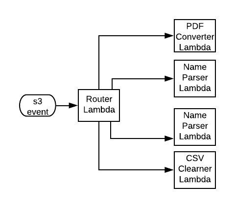

# PDF Conversion Extraction 

## Overview
Files are processed and transformed by AWS Lambda functions and stored on S3. Lambdas
are built, managed and deployed by [Apex](http://apex.run).

All Lambda functions are defined in the "functions" directory:
```
project.json
functions
├── bar
│   ├── function.json
│   └── index.js
└── foo
    ├── function.json
    └── index.js
```

Router Lambda is triggered by S3 put events and is  responsible for triggering
worker Lambas to process files:



## Install

Follow [instruction](http://apex.run/#installation) to install Apex Lambda
Deployment tool

## Deploy

from project root:
```
$ apex deploy {lambda-name} 
```